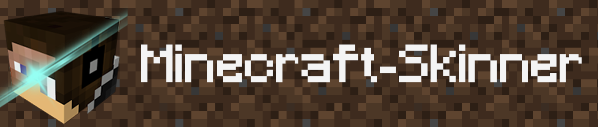
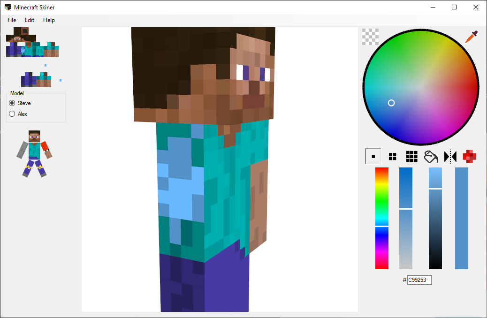
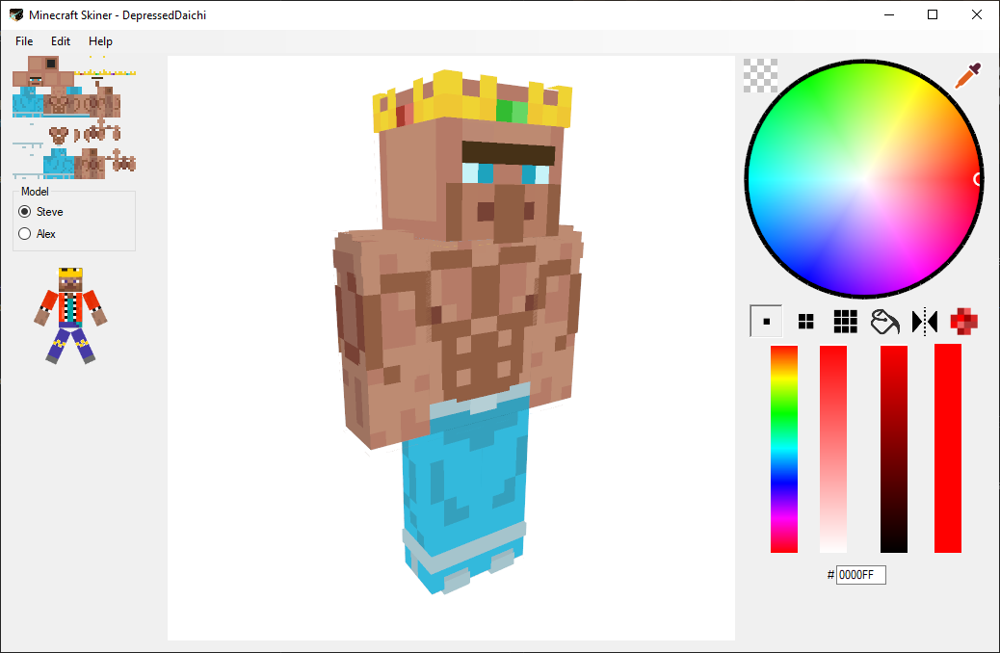
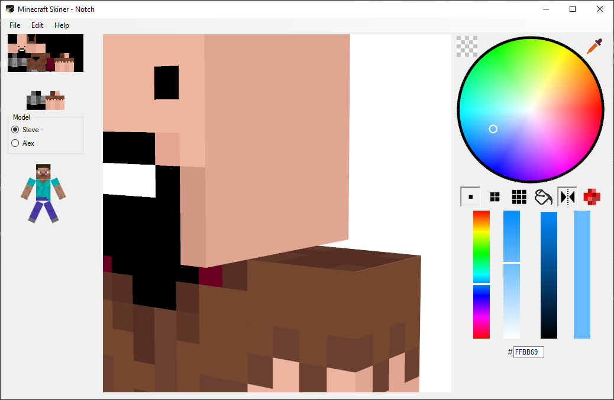

# Minecraft Skinner

A [Minecraft skin](https://minecraft.gamepedia.com/Skin) editor.

## About the app

This is an ambitious project I started back in 2016. A full Minecraft skin editor that is capable of helping professional or hobbyist skin creators to create and edit their Minecraft skins.

The project was made in VB.net using an OpenGL wrapper called [OpenTK](https://opentk.net/) for rendering.

## Features

- Full 3D view of the skin with zooming, moving and rotating
- Steve and Minecraft 1.8 Alex models are fully supported
- Different brush sizes (1x1, 2x2, 3x3) and modes (Fill, Mirror, Camo)
- 2nd layer textures on the skin are fully supported
- A pre-1.8 skin editing mode
- Ability to directly download an existing player skin from Mojang servers or uploading it through the app with a single click *(API changes resulted disabling some functionality in the meantime)*

## Screenshots

*This skin belongs to DepressedDiachi*

*This skin belongs to [Notch](https://twitter.com/notch) the creator of Minecraft*

## Current Status

**The project is abandoned in the meantime. But I have intentions to continue working with it for fun.**

### Future plans

- Convert the project to .NetCore C#

    In its current state the project needs some serious refactoring as when I started I wasn't really know what I am doing. So, I have this plan to build the project from scratch using .NetCore C# with some assistance from the original base code.

- Use [WPF](https://docs.microsoft.com/en-us/visualstudio/designers/getting-started-with-wpf) instead of Windows Forms
- Convert the rendering method to use [VBOs](https://en.wikipedia.org/wiki/Vertex_buffer_object).
- Add layers
- Add more effects
- 2D Edit

    Add the ability to edit the texture in 2D view, can be used to add easter eggs in the unused portions of the skin

- Add grid
- Improved GUI (More like Photoshop)
- New menu to make fast custom skins *(Really don't know what that mean but it was in my old TODO so I added it anyways)*
- Add a render engine to render images in different poses

## Download

You can download the latest version from [here](https://github.com/KareemMAX/Minecraft-Skiner/releases).

For all releases check [here](https://github.com/KareemMAX/Minecraft-Skiner/releases).
